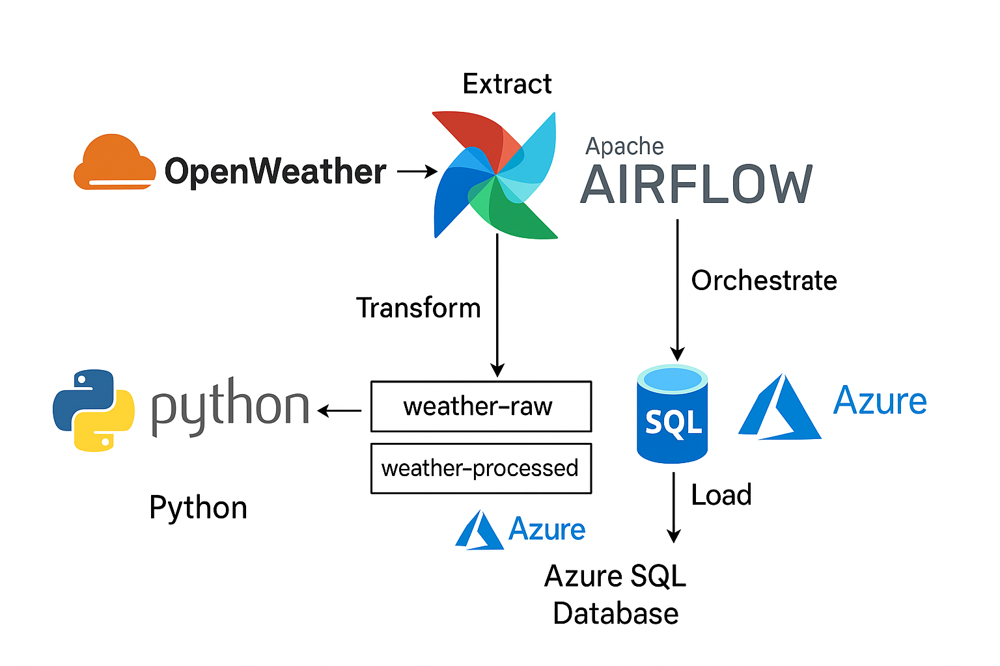

# Automated Data Pipeline Using Apache Airflow

## 🚀 Project Overview
This project demonstrates an end-to-end data engineering pipeline that collects real-time weather data using OpenWeatherMap API, processes it, and stores it in Azure Blob Storage and Azure SQL Database - orchestrated by Apache Airflow and containerized with Docker.

## 🏗️ Architecture

## 🧠 Pipeline Workflow

1. `extract.py` fetches weather data for a city and uploads the raw JSON to Azure Blob Storage (`weather-raw` container).
2. `transform.py` reads raw JSON, converts it into a clean CSV format, and uploads it to the `weather-processed` container.
3. `load.py` reads the latest processed CSV from Blob Storage and loads it into a table in Azure SQL Database.
4. Airflow DAG (`weather_etl_pipeline`) schedules and manages the entire ETL pipeline daily using three PythonOperator tasks: extract → transform → load.

## 🔧 Tools & Tech Stack
- Apache Airflow (DAGs, scheduling, monitoring)
- Azure Blob Storage (cloud storage for raw & processed data)
- Azure SQL Database (relational data storage for analytics)
- Python (requests, pandas, sqlalchemy)
- Docker (containerized Airflow)
- OpenWeatherMap API (live weather feed)

## 📁 Azure Containers
- `weather-raw`: holds raw JSON files
- `weather-processed`: holds cleaned CSV files

## 🗄️ Azure SQL Database
- **Table name**: `weather_data`
- Columns:
  - `city`
  - `timestamp`
  - `weather`
  - `temperature`
  - `humidity`
  - `wind_speed`
- The data from the processed CSV is inserted into this table using the SQLAlchemy.
  
## Check the CLI Commands Guide :
[🛠️ CLI Commands Guide](cli_commands.md)

